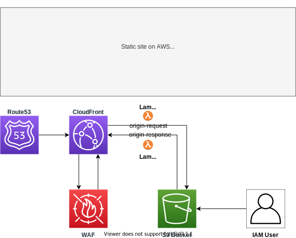

# Site



A terraform module for creating a simple static site that's stored on S3 and served by CloudFront. This can be achieved in many different ways in AWS, I wanted to achieve the following:

- It should serve `index.html` in the root  
  That is, `example.mads-hartmann.com` should serve `example.mads-hartmann.com/index.html`. CloudFront allows this by setting `default_root_object`.

- It should serve `index.html` in subdirectories  
  CloudFront doesn't support this out of the box as `default_root_object` only applies to the root. This has been achieved by associating a [Lambda@Edge](https://aws.amazon.com/lambda/edge/) (origin-request) function with CloudFront distribution which does the request re-writing - this is to my knowledge the only way to achieve this if you want to keep the bucket contents truly private, more details below.

- It should serve `404.html` when requesting a resource that doesn't exist  
  This has been achieved by using a [Custom Error Response](https://docs.aws.amazon.com/AmazonCloudFront/latest/DeveloperGuide/GeneratingCustomErrorResponses.html) together with a origin-response lambda@edge function which turns 403's from S3 into 404s.

- It should serve `403.html` when a request it blocked by the WAF  
  This has been achieved by using a [Custom Error Response](https://docs.aws.amazon.com/AmazonCloudFront/latest/DeveloperGuide/GeneratingCustomErrorResponses.html).

- The S3 bucket should __only__ be reachable through CloudFront  
  The bucket is private, the CloudFront distribution has been configured to use a [Origin Access Identity (OAI)](https://docs.aws.amazon.com/AmazonCloudFront/latest/DeveloperGuide/private-content-restricting-access-to-s3.html) which has been grated read-only access to the bucket. Additionally, the bucket has been configured with [Amazon S3 Block Public Access](https://docs.aws.amazon.com/AmazonS3/latest/dev/access-control-block-public-access.html) so that the bucket or objects in it can't ever be made public.

- It should have basic attack prevention  
  A WAF Web ACL attached to CloudFront. The WAF has been configured to block IP addresses that have [identified as malicious actors and bots by Amazon threat intelligence (AWSManagedRulesAmazonIpReputationList)](https://docs.aws.amazon.com/waf/latest/developerguide/aws-managed-rule-groups-list.html#aws-managed-rule-groups-ip-rep), as well as a general rate-based rule based on IP addresses. **NOTE:** I made the WAF optional through the `enable_waf` input variable as you pay per rule regardless of how much traffic you're receiving, see [pricing](https://aws.amazon.com/waf/pricing/).

This will create the following resources:

- A private S3 bucket for hosting the static files
  - A [Amazon S3 Block Public Access](https://docs.aws.amazon.com/AmazonS3/latest/dev/access-control-block-public-access.html) rule to make sure bucket and its content is really private.
- A CloudFront distribution for serving and caching the contents in S3
  - An Origin Access Identity (OAI) to give CloudFront access to the S3 bucket.
  - A Lambda@Edge handler for the origin-request events to perform request re-writing to serve index.html for subdirectories
  - A Lambda@Edge handler for the origin-response events which turns 403s from S3 into 404s
  - A WAF ACL with some AWS managed rules as well as ip-based rate-limiting
- A Route53 Alias DNS record for the domain that points to the CloudFront distribution.
- An IAM User and associated access key for uploading new files and invalidating the cache; this is to decouple provisioning from deploys.

## Usage

__The provider has to be us-east-1, as that's a requirement for cloudfront and associated resources.__

```terraform
# Some resources *have* to be created in us-east-1. For example CloudFront distributions and
# some of the associated resources like WAFs, certificates from ACM, and lambda@edge all have
# to be defined us-east-1
provider "aws" {
  region = "us-east-1"
  alias  = "us-east-1"
}


module "example-mads-hartmann-com" {
  source              = "../modules/site"
  domain              = "example.mads-hartmann.com"
  acm_certificate_arn = "..."
  route53_zone_id     = "..."
  enable_waf          = true

  providers = {
    aws = aws.us-east-1
  }
}
```

## Implementation notes

### Why not use CNAME directly to S3 website-enabled bucket

<!-- CloudFront adds features like HTTPS on your own domain name, redirecting clients from HTTP to HTTPS, IPv6, HTTP/2, and caching. -->

- I want caching (which CloudFront provides)
- I want a WAF for basic protection against attacks
- I want HTTPS (which website buckets don't support afaik)

### Why not use s3 website-enabled bucket for the CloudFront origin

- The objects in website-enabled bucket can't be private
- The S3 website URL would be public if discovered, which means people could circumvent caching.

## Based on

- [Implementing Default Directory Indexes in Amazon S3-backed Amazon CloudFront Origins Using Lambda@Edge](https://aws.amazon.com/blogs/compute/implementing-default-directory-indexes-in-amazon-s3-backed-amazon-cloudfront-origins-using-lambdaedge/)
- [Restricting Access to Amazon S3 Content by Using an Origin Access Identity](https://docs.aws.amazon.com/AmazonCloudFront/latest/DeveloperGuide/private-content-restricting-access-to-s3.html)
- https://github.com/twstewart42/terraform-aws-cloudfront-s3-website-lambda-edge is a similar implementation
